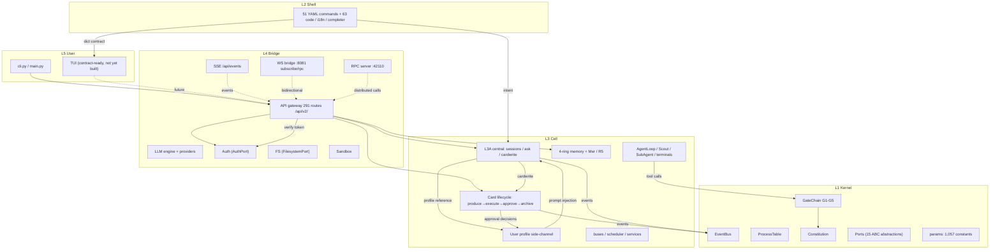

# Praxis Architecture — Layer Reference

Five-layer Agent Operating System. Each layer document covers responsibility
boundaries, module inventory, core mechanisms, and contract surfaces.

> **Numbers below are generated** — run `python scripts/py/gen_doc_stats.py`
> to refresh; never hand-edit them.

## System overview



## Layer documents

| Layer | Document | Responsibility |
|-------|----------|----------------|
| L5 | [l5-user.md](l5-user.md) | CLI entry, user-facing contract, TUI surface |
| L4 | [l4-bridge.md](l4-bridge.md) | API gateway (291 routes), WS/SSE/RPC channels, sandbox, auth, fs |
| L4 | [l4-llm.md](l4-llm.md) | LLM providers, effort tiers, strategy packs, model_spec cascade |
| L3 | [l3-card-lifecycle.md](l3-card-lifecycle.md) | Card end-to-end: produce → execute → approve → archive |
| L3 | [l3-memory.md](l3-memory.md) | 4-ring memory + side-channels (Mer / R5 / User Profile) + injection |
| L3 | [l3a-central.md](l3a-central.md) | L3A decision layer: the central office (sessions, ask, cardwrite, profile) |
| L3 | [l3-tools.md](l3-tools.md) | 20 tool implementations + tool system (spec/registry/policy/pipeline) |
| L3 | [l3-tool-presentation.md](l3-tool-presentation.md) | Code Mode / PTC: presentation modes (native/code/both), run_code transport, per-Cell program cache |
| L3 | [l3-prompt-architecture.md](l3-prompt-architecture.md) | Unified layered system prompts: Cell/global libraries (sub-libs), versioning, bypass monitor |
| L3 | [l3-bus.md](l3-bus.md) | IPC protocol (20+ message types) + buses + ReferenceChannel causal recorder |
| L3 | [security-evidence.md](security-evidence.md) | Attack-posture evidence chains: fixity-verified records, verdicts, bypass audit API |
| L3 | [l3-cell-os.md](l3-cell-os.md) | Cell SoC components (ICache/MMU/PMU/Watchdog/…), boot, lifecycle |
| L3 | [l3-scheduler.md](l3-scheduler.md) | 5D scheduler (route/pool/time/rate/scope) + safety layers |
| L3 | [l3-routing.md](l3-routing.md) | HTN intent decomposition + L3B cross-cell routing |
| L3 | [l3-convention.md](l3-convention.md) | cross-cell deliberation (orchestrator/answers/aggregate/report) |
| L2 | [l2-shell.md](l2-shell.md) | Shell family over shared engine, i18n, completer, agent selector (current implementation) |
| L2 | [l2-shell-engine.md](l2-shell-engine.md) | Target Shell Engine: unified session data layer (protocol v1), frontend adapters, single execution bridge, TS rewrite mapping |
| L2 | [l2-multifrontend-session-layer.md](../roadmaps/l2-multifrontend-session-layer.md) | L2 boundary audit baseline (36/100) + multi-frontend session-layer roadmap (P0–P4) |
| L1 | [l1-kernel.md](l1-kernel.md) | Process table, sync, event bus, constitution, GateChain, ports, params |
| — | [cross-cutting.md](cross-cutting.md) | Governance, events, injection switches, testing/QA, skills, collaboration |
| — | [quality-baseline.md](quality-baseline.md) | Per-layer quality gates: measured vs baseline scan (layer_quality.py), hard/soft gate model |
| — | [perf-baseline.md](perf-baseline.md) | Per-layer performance gates: benchmark vs baseline scan (perf_quality.py), drift floor |
| — | [automation.md](automation.md) | Declarative automation manifest, DAG planning, ProcessPort execution, and evidence hooks |
| — | [multilang-build.md](multilang-build.md) | Rust workspace and TypeScript protocol build boundary for the staged rewrite |
| — | [completion-judge.md](completion-judge.md) | CompletionJudge: 11-dimension "done" gate, COMPLETE/PARTIAL/INCOMPLETE verdicts, shared JSONL log, mode-split dashboard |
| — | [skill-system.md](skill-system.md) | Skill manager (L1), R4Agent evolution, per-Cell bindings, staged/guided skills |
| — | [runtime-subsystems.md](runtime-subsystems.md) | error bus (trace_id), AgentLoop entities, boot, search, LLM workers, resource buffer, ConfigDiscovery |
| — | [sandbox-diff.md](sandbox-diff.md) | Structured diff system: per-hunk attribution model, diff views, three-tier topology, tiered compression |

## Numbers snapshot

| Metric | Value |
|--------|-------|
| L1 Kernel | 66 files / 19,226 lines |
| L2 Shell | 45 files / 6,587 lines |
| L3 Cell | 337 files / 73,588 lines |
| L4 Bridge | 113 files / 23,539 lines |
| L1 Kernel | 69 files / 18,623 lines |
| L2 Shell | 45 files / 6,587 lines |
| L3 Cell | 349 files / 78,434 lines |
| L4 Bridge | 113 files / 23,539 lines |
| L5 User | 2 files / 599 lines |
| L3A (peers) | 26 files / 7,217 lines |
| L3 Memory | 46 files / 10,747 lines |
| L3 Card | 27 files / 6,451 lines |
| L3 Services | 45 files / 11,593 lines |
| L3 Bus | 17 files / 4,396 lines |
| L3 Agent | 36 files / 7,483 lines |
| L4 Handlers | 34 files / 6,411 lines |
| API routes | 368 (`/api/v2/*` versioned) |
| Route domains | 46 (largest: memory=37, skill=29, system=18, security=18, provider=17) |
| Params modules / constants | 8 / 1,263 |
| Health | 0.757 (grade B) |
| L3 Agent | 37 files / 8,690 lines |
| L4 Handlers | 34 files / 6,411 lines |
| API routes | 368 (`/api/v2/*` versioned) |
| Route domains | 46 (largest: memory=37, skill=29, system=18, security=18, provider=17) |
| Params modules / constants | 8 / 1,208 |
| Health | 0.696 (grade B) |

## Reading path

1. **New to Praxis**: [l1-kernel.md](l1-kernel.md) → [l3-card-lifecycle.md](l3-card-lifecycle.md) → [l3a-central.md](l3a-central.md)
2. **Frontend / contract work**: [l4-bridge.md](l4-bridge.md) → [l5-user.md](l5-user.md) → [cross-cutting.md](cross-cutting.md)
3. **Memory / agents**: [l3-memory.md](l3-memory.md) → [l3-scheduler.md](l3-scheduler.md) → [l3-tools.md](l3-tools.md)
4. **Data / training / buses**: [l3-bus.md](l3-bus.md) → [cross-cutting.md](cross-cutting.md)
5. **Security / posture**: [security-evidence.md](security-evidence.md) → [l1-kernel.md](l1-kernel.md) (GateChain) → [l3-tools.md](l3-tools.md)
6. **Governance / QA / skills**: [cross-cutting.md](cross-cutting.md)

## Main data flows

```
INTENT: user will → L3A session (profile reference) → cardwrite → card
CARD:   produce → execute (plan/agents/tools via GateChain) → approve → complete → R4 archive
EVENT:  source → EventBus (async) → SSE /api/events + WS :8081 → frontends
DATA:   gate decisions → ReferenceChannel (JSONL + SHA-256) → training pipelines
SESSION:send → inbox → loop → history (cursor-paged) → close → archive → resume_from_archive
DIFF:   sandbox write → structured hunks (per-hunk attribution) → tier-2 review
        (LSP/AST context + bypass monitor) → small: directed fix / large:
        route_to_cell REVIEW_REWORK → L3A report; RC line records; frontend
        ring → JSONL flush → zstd-19 archive → R4 (fonds="diff")
```

## Design principles

| Principle | What it means in practice |
|-----------|--------------------------|
| **Will cannot violate the constitution** | Constitution is the highest authority; every tool call passes GateChain G1–G5 before execution |
| **Bypass side-channels** | Mer/R5/profile never mutate the main flow; on error they degrade to no-ops — originals stay intact |
| **Language-agnostic contract** | Frontends (TUI/desktop/TS) talk to the kernel only over `/api/v2/*` + WS/SSE — the kernel may be reimplemented in another language (or multi-language, e.g. Rust hot-path modules) without rewriting the UI |
| **Port abstractions, duck-typed** | `get_port(name)` resolves adapters at runtime; swapping the kernel changes adapters only |
| **User-configurable injection** | Every system-prompt block is gated by `prompt.inject.<domain>`; settings failure falls back to enabled (safety never stripped silently) |
| **Versioned API, validated manifest** | `/api/v2/*` only; `api_endpoints.validate()` rejects naming violations; bumps are atomic |
| **Discipline is executable** | worktree checks, layer-import tests, params-compliance, commit hooks — rules become machine checks, not advice |
| **Anti-blowup by construction** | cursor paging, token caps, bounded queues, display windowing — no unbounded accumulation anywhere |

## Archived

Pre-rewrite architecture documents (v1: overview / reference / deep-dive /
SOC) were superseded by this reference in the 8-file split (`38c5dd9`) and
the later layer rewrite. Their content survives only in git history
(`git log --all --diff-filter=D -- docs/architecture/`, then
`git show <commit>:<path>` to recover). Current archive policy: review and
design documents that close out land in `docs/design/archive/`, which is
intentionally **untracked** (`.gitignore`) — those files live on the main
tree disk only, not in any worktree or clone.
