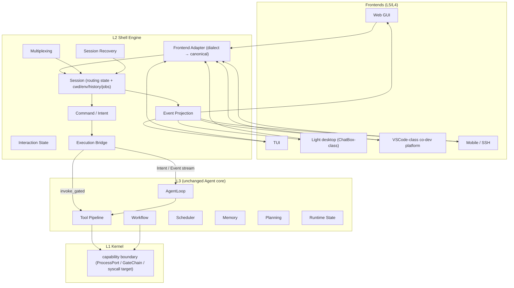

# L2 — Shell Engine Layer

Target architecture for the L2 shell family: one **Unified Session Data Layer**
that multiplexes every frontend dialect (web / TUI / lightweight desktop /
VSCode-class IDE / mobile SSH) onto a single Intent/Event stream, backed by one
execution-request bridge into L3 (agents, tools, workflow) and L1 (kernel
capabilities). This document supersedes the "CLI command collection" reality
described in `l2-shell.md`; the audit baseline and staged plan live in
`docs/roadmaps/l2-multifrontend-session-layer.md`.

Current snapshot (2026-08): 43 modules / 5,860 lines; 51 YAML commands + 63
`_cmd_*` handler functions (15 code-only); 74 allowlisted cross-layer imports (67 → L3,
7 → L4). Boundary audit score: 36/100 (see roadmap §1).

## Responsibility boundary

L2 is the **kernel-adjacent system-interaction and command-interpretation
layer**: it translates frontend dialects into one canonical data stream and
forwards every side-effecting request through a single execution bridge.

Owns:

- Command parsing (lexer → AST → typed invocation), dispatch, aliases
- Shell session: routing state (mode/cell/agent/session_id), cwd, env, history, job table
- Pipeline *semantics* (parse + graph; never execution)
- IO routing description (stdin/stdout/stderr redirection as data, not syscalls)
- Job control *user semantics* (jobs/fg/bg/kill as requests)
- Built-ins (help/status/history/alias/env/jobs/fg/bg/exit/clear/lang)
- Terminal interaction, help, completion, error presentation
- Frontend adapters, session multiplexing, event projection, session recovery

Never owns (must forward instead):

- Kernel mechanism (process spawn/kill, resource accounting, capability
  authorization, lifecycle authority, persistence, audit, global locks)
- Security / policy authority (approval, ring, sandbox, posture, injection verdicts)
- Agent runtime (agent loop, planning, memory, workflow, scheduler, model choice)
- Domain services (cards, skills governance, settings, CI review, MCP bridge)

## Target architecture



The contract with L3 is **data-only**: one normalized stream
(`intent | command | event | result | stream_chunk | control`). L3 keeps all
agent logic (AgentLoop, Tool Pipeline, Workflow, Scheduler, Memory, Planning,
Runtime State); L2 never imports L3 internals for control flow, only for the
bridge surface listed in `## Contract surfaces`.

## Unified Session Data Layer (protocol v1)

One session owns one logical stream; every frontend is an adapter that
projects the same stream into its own view. The wire format is language-agnostic
(JSON Lines), so the engine can be rewritten in TypeScript without touching L3.

### Message envelope

```json
{"v": 1, "session_id": "s-01J…", "seq": 42, "ts": 1723812345.678,
 "trace_id": "tr-…", "kind": "intent", "payload": {…}}
```

- `seq` — per-session monotonic id; the recovery cursor.
- `trace_id` — reuses the unified trace (L3 `error_bus` convention); never mint new ids.
- `kind`:
  - `intent` — natural-language intent (via `/intent`; legacy `!` prefix accepted) → L3 AgentLoop
  - `command` — structured `/`-command invocation → dispatch table
  - `event` — state/status/stream metadata (task started, tool gated, session switched)
  - `result` — terminal one-shot result (dict contract, render-ready)
  - `stream_chunk` — incremental output (stdout/tool-stream/agent-token)
  - `control` — attach/detach/resume/recovery/ack (session lifecycle, not commands)
  - `ack` — `{"ack_seq": N}` confirming durable consumption

### Conversion rules (dialect → canonical)

| Frontend input | Canonical message |
|---|---|
| `/status` (all frontends) | `command{name:"status", args:[]}` |
| `/scout investigate X@cell/agent` | `intent{type:"scout", task:"…", target:{cell,agent}}` |
| `$ ls -la` | `command{name:"__system", args:["ls","-la"]}` → Execution Bridge → ProcessPort |
| `cat x | grep y` | `command{name:"__pipeline", stages:[…]}` (semantics only; L2 never spawns) |
| web `POST /api/v2/shell` body | same envelope (adapter wraps/unwraps HTTP) |
| mobile SSH line | same envelope (transport = stdio/SSH channel) |

### Session multiplexing & recovery

- One `ShellSession` may bind N frontend views (multiplexing); each view holds
  an `ack_seq` cursor. `Event Projection` renders the shared session state
  into per-frontend shapes (web JSON / TUI table / desktop rich / IDE LSP-ish).
- Recovery: `control{kind:"recovery", last_acked: N}` — L2 replays the
  un-acked window from its bounded outbox, then re-attaches. Session truth
  stays in L3 (`SessionManager`) and L1 (kernel state); L2 only carries the
  routing view + outbox, so an L2 restart never forks agent state.
- Interrupted commands / orphan jobs: the L2 job table is a *projection* of
  L3/L1 job truth; on restart L2 re-syncs by query, never by guessing.

### Reference implementation & contract pins (landed)

The protocol is not just a design: a pure Python reference, machine-readable
schemas, contract-pin tests, and a stdio host are already in the tree. All
are **additive** - no existing engine behavior was changed.

| Asset | Path | Purpose |
|---|---|---|
| Envelope reference | `src/l2/protocol/envelope.py` | pure make/validate/encode/decode + `Outbox` (bounded replay) + `SessionCursor`; stdlib-only, zero singletons, zero I/O |
| JSON Schemas | `src/l2/protocol/schema.py` | Draft-07 envelope + per-kind payload schemas - the TS zod/io-ts mirror target |
| Stdio host | `src/l2/protocol/host.py` (`python -m l2.protocol.host`) | JSONL bridge over the existing `l2.l2_shell.dispatch`; command/intent/control in, result/event/ack out; fail-closed on bad input |
| Contract pins | `tests/l2/test_protocol_v1.py` | envelope round-trip, validation, outbox cursor/ack/cap, schema alignment, host smoke tests |
| Dispatch JSON contract | `tests/l2/test_dispatch_contract.py` | every render-ready dispatch result must survive `json.dumps`; stable shapes for /help /lang /history /sysinfo, unknown-command, pipeline, alias |

Usage (the future `bridge.ts` speaks exactly this):

```bash
$ printf '%s\n' '{"v":1,"session_id":"s-1","seq":1,"ts":0.0,"kind":"command","payload":{"name":"lang"}}' \\
    | python -m l2.protocol.host
{"kind":"result","payload":{"available":["en","ja","ko","zh-CN"],"locale":"en","success":true},...}
{"kind":"ack","payload":{"ack_seq":1},...}
```

TS mirror strategy: port `envelope.py` semantics 1:1 into `envelope.ts`,
translate `schema.py` into zod/io-ts types, and run the same expectations as
`test_protocol_v1.py` in vitest - the Python tests double as the TS spec.
The host is the integration seam: `bridge.ts` spawns it as a child process
(or connects over WebSocket later) and only ever speaks protocol v1.

## Execution bridge

Every side-effecting request exits L2 through exactly one bridge:

| Request | Bridge target | Boundary |
|---|---|---|
| tool call (`!` intent, tool line, agent tool request) | `l3.tool_system.invoke.invoke_gated(…, interactive=True)` | L3 Tool Pipeline (clearance/approval/rate/constitution/gatechain/sandbox) |
| `$` system command | `l1.kernel.ports.get_process_port().run()` | L1 ProcessPort |
| slash control command (settings/cards/skills/model/…) | L3 **command bridge** (to be built; replaces 63 direct imports) | L3 service facade |
| event emission | kernel event API only if L1 owns the event; otherwise L3 bus | — |

L2 itself performs no direct filesystem writes, no network I/O, no
`subprocess.Popen`, no tool-handler invocation, no DB mutation.

## Module inventory (audit verdicts)

| Module (today) | Verdict | Target |
|---|---|---|
| `l2_shell/__init__.py` dispatch/alias | keep (A) | split: `parser.ts` + `dispatcher` |
| `shells/{base,family,session}.py` | keep (A) | `session.ts` state machine |
| `shells/terminal.py` dialect | keep (A) | adapter for terminal frontend |
| `l2_shell/completer.py`, `shell_completer.py`, `i18n.py` | keep (A/F) | UX layer |
| `l2_shell/commands/{common,system,connect}.py` | keep shell built-ins; move control commands | split per verdict |
| `l2_shell/commands_settings.py`, `model.py`, `memory.py`(card/spawn/kill), `ci.py`, `harness.py`, `test_auto.py`, `extra_mcp.py`, `extra_security.py`, `departments.py`, `identity_binding.py`, `l3a.py` | **move out** (B/E/D) | L3 admin surface behind command bridge |
| `selector.py` | **move policy out** | keep only "user picks agent"; injection verdict → L3 |
| `output_guard.py` | move policy; keep presentation filter | L3 policy + render guard |
| `shell_session.py` (Popen TerminalManager) | **delete** (dead code; 0 callers) | never re-add; long-lived processes → L1 platform port |
| `_l3a_intent` (broken import `l2.l2_shell.cell`) | **fix or delete** | route through L3 command bridge |

## Completeness matrix (target)

| Capability | Current | Target |
|---|---|---|
| Lexer / Parser / AST / error recovery | MISSING | COMPLETE (TS `parser`) |
| Command registry + dispatch | COMPLETE (owner: L1, writers ×3) | COMPLETE (registry owner: L2, single writer) |
| Built-ins (cd/pwd/env/export/alias/jobs/fg/bg/exit/…) | PARTIAL (stubs) | COMPLETE |
| External commands | PARTIAL (`$` only) | COMPLETE (bridge-integrated) |
| Session lifecycle + cwd/env/history | PARTIAL/MISSING | COMPLETE |
| Job control | MISSING | COMPLETE (projection of L3/L1 truth) |
| Pipeline (parse+graph; no exec) | MISSING (fake arg-chain) | COMPLETE |
| IO redirection | MISSING | COMPLETE (as data) |
| Interactive UX | PARTIAL | COMPLETE |
| Execution bridge | PARTIAL (tool side fixed in WT) | COMPLETE (single bridge) |
| Recovery (interrupt/orphan/restart) | MISSING | COMPLETE |

## TS rewrite mapping

| Today (Python) | TS module | Notes |
|---|---|---|
| `dispatch` + `shlex` | `parser.ts` + `dispatcher.ts` | pure; no side effects |
| `ShellSession` / `ShellFamily` | `session.ts` (state machine) | JSON-serializable |
| `shells/*` | `adapters/*.ts` | per frontend |
| `commands/*` built-ins | `builtins/*.ts` | pure functions over session |
| `l2_shell/state.py`, `completer.py` | `state.ts`, `complete.ts` | — |
| execution calls (L3/L1) | `bridge.ts` (single client) | speaks protocol v1 to the Python L3 host (stdio/WebSocket/HTTP); **L3 Agent logic stays Python** |
| `i18n.py` | `i18n.ts` | same locale data |

The TS engine is a *host-agnostic frontend of L3*: it never re-implements
AgentLoop/Tool Pipeline/Workflow/Scheduler/Memory/Planning. The L3 host remains
the single authority; TS L2 is a pure projector + dispatcher + bridge client.

## Contract surfaces

- **L3**: `invoke_gated` (tools), L3 command bridge (control commands, to be
  built), L3A session lifecycle via bridge, data-only Intent/Event stream.
- **L1**: `ProcessPort.run` (`$`), `CommandRegistry` (migrate to L2),
  params constants, kernel event API only where L1 owns the event.
- **Frontends**: `POST /api/v2/shell` (web), TUI adapter, desktop adapters,
  mobile/SSH adapter — all speak protocol v1.
- **Never**: direct tool handler calls (`_execute_tool_spec` stays private),
  `subprocess.Popen` in L2, private internals of L4 providers, direct
  settings/card/skill mutation without the bridge.

## Related docs

- `docs/roadmaps/l2-multifrontend-session-layer.md` — audit baseline + staged plan
- `docs/roadmaps/kernel-boundary-audit.md` — L1 twin audit (Rust baseline)
- `docs/roadmaps/frontend-kernel-roadmap.md` — frontend matrix + kernel Rust sink
- `docs/roadmaps/multilang-migration.md` — run_code/PTC TS slot
- `docs/architecture/l2-shell.md` — current (superseded) shell description
- `docs/architecture/l1-kernel.md` — kernel boundary this layer builds on
