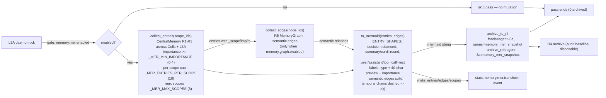
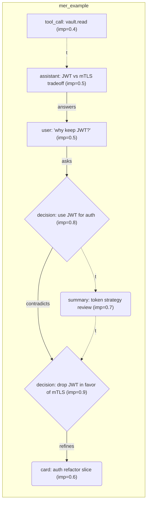

# L3 — Memory System (4 rings + side-channels)

How agents remember: operational rings, lossless archive, and the bypass
side-channels (Mer / R5 / User Profile). 41 files / 8,545 lines.

## Four-ring architecture

```
R1 working   — current task context (agent-local, hot)
R2 short     — session-scale memory (auto-persist, JSONL)
R3 long      — FTS5 searchable knowledge (SQLite)
R4 archive   — lossless, append-only (fonds/series/ref-code), restore baseline
```

| Concern | Module |
|---------|--------|
| Manager + rings | `memory.py`, `memory_ring.py`, `pager_swapper.py` |
| Multi-scope center | `central_memory.py` (register scopes: cells + L3A) |
| Persistence | `persist.py`-style mixins; crash-safety: dirty sets cleared only after write success |
| FTS5 / recall | `context_search.py`, `quality.py` (importance filtering) |
| R4 agent | `r4_agent.py` (archive, skill evolution, lean cases) |
| Task-aware injection | `memory_inject.py` (execute→summary / decide→Mer / resume→layered) |
| Init from memories | `memory_init.py` (boot restores agent topology) |

## Side-channels (bypass, all default off)

Independent transformations that never mutate the main flow; on error they
degrade to no-ops (originals intact):

| Channel | Module | What it does | Switch |
|---------|--------|--------------|--------|
| **Mer symbolization** | `memory_mer.py` | Aggregates high-value R1–R3 across scopes → **Mermaid flowchart** (node shapes = entry type: decision=diamond, summary/card=round; labels carry importance; R5 semantic edges solid; within-scope temporal chains dashed `-.->|t|`) → R4 (`agent-l3a/memory_mer_snapshot`) | `memory.mer.enabled` |
| **R5 graph** | `memory_graph.py` | SQLite `memory_edges`; rule + semantic (LLM) edges; diffusion recall; compact/reduce | `memory.graph.enabled` |
| **User profile** | `l3/services/user_profile.py` | Typed per-user model (preference/domain_focus/decision_style/rejection/habit/correction/trait/custom); collectors (APPROVAL_RESPONDED → decision_style, CARD_PENDING → domain_focus) + ingest API; rule refiner; TTL/decay; R4 per user; portable export/import; consumed by L3A (see `l3a-central.md`) | `user_profile.enabled` |

Side-channel lifecycle events are ingested into StatsCenter for
observability: Mer emits `stats.memory.mer.switch/transform/archived`, R5
graph emits `stats.memory.graph.switch/edge_mode/compact/semantic` — both
`_emit_event()` hooks publish to MonitorBus AND StatsCenter (best-effort,
never break the bypass pipeline).

### Mer data flow (bypass pipeline)



Guarantees: bypass semantics (never mutates the main flow), lossless
originals (only a rendered condensation is archived), bounded work
(per-scope caps, max scopes, edge truncation).

### Mer symbolization example

All node shapes and edge styles in one view — diamond (decision), round
(summary/card), rect (user/assistant/tool_call); solid arrows are R5
semantic edges, dashed `-.->|t|` arrows are within-scope chronology:



## System-prompt injection (memory-related)

`prompt.inject.memory` (default true) gates task-aware memory context in
agent prompts; `prompt.inject.skills` gates evolved skills + lean failure
cases. See `cross-cutting.md` for the full injection table.

## Contract surface

- `/api/v2/memory*` (store/recall/stats), `/api/v2/memory/graph*` (R5),
  `/api/memory/mer/*` (Mer), `/api/v2/profile*` (user profile)
- `/api/v2/memory/filter` (M1 domain-filter switches),
  `/api/v2/memory/corpus` (M4 correction-corpus export),
  `/api/v2/memory/digest` (conversation digest cache),
  `/api/v2/memory/tool-result` (tool-result offload cache),
  `/api/v2/memory/sensitive` (sensitive-info bypass detection),
  `/api/v2/memory/compression-guard` (recursion threshold + breaker)
- Ports: none dedicated (memory accessed in-process); profile exposes
  port `"profile"` for cross-service queries
- Tiered-cache consumers: the per-Cell `run_code` program cache
  (`run_code_cache.py`, Code Mode / PTC) stores model-written programs +
  results in the tiered-cache L1 layer with TTL; see
  `docs/architecture/l3-tool-presentation.md`.

## Domain filtering & refinement (M1–M4)

The write path (`memory.py` remember → `memory_ingest`) and every retrieval
path (recall, `search_long_term`, `archive_search`) are gated by the M1
domain filter (`memory_domain_filter.py`):

- **Identity/Cell-domain gating**: entries are visible only to the
  requesting identity/Cell. Both switches are operator-controlled
  (`/api/v2/memory/filter` + L2 `/memory filter`): `enabled` (master,
  default off) and `fine_grained` (identity sub-domains). The Cell-domain
  boundary holds in every mode; fine-grained only adds the identity gate.
- **HTN-C identity-hit semantics**: Cell agents are peer entities — the
  active identity comes from `match_identity` on the driving intent/domain
  (verify→test, implement→build), never a static role; unbound single-Cell
  composites fall back to the full `IDENTITY_DEFAULT_SET`.
- **R4 included**: `archive_search` applies the same gate as R1–R3. R4
  entries carry an explicit `cell:<id>` tag on write (`archive_to_r4`),
  which the search path parses into `cell_id` so the Cell gate matches
  archived Mer baselines the same way as live rings; untagged entries stay
  globally visible (system-level records).

The M2 refinery (`memory_refinery.py`) classifies → dedups → cleans →
scores → extracts → transforms every written entry, with a burn-back
re-refine stage that re-scores clean()-dropped edge entries
(`MEMORY_REFINE_REBURN_*` params). Refined records persist to the L3
archive (`memory:refined_records`) and feed M3 (`memory_supply_chain.py`):
R5 graph edges (`supply_to_r5`, graph-gated), generalized skill evolution
(`supply_to_skills`, switch-gated), and filtered re-injection
(`re_inject_filtered`). M4 (`memory_record_source.py`) registers a
RecordCenter source exporting identity/Cell-feature/log-enriched corpus
for training correction, exposed via `/api/v2/memory/corpus` + L2
`/memory corpus` (`export_corpus`).

**Reference-channel linkage**: every accepted memory write emits a
`memory_refined` event on the reference channel (`get_rc().event`, source
`memory_ingest`) carrying entry id/type/cell/agent/importance/ring — the
causal audit ring correlates memory events with tool and identity context
for M4 corpus analytics. Best-effort, never blocks the write.

## Conversation-side caches (digest + offload)

Two operator-gated caches raise the compression ratio on the agent
conversation path while keeping information recoverable:

- **Digest cache** (`agent/digest_cache.py`): when the master switch is on
  (default off), a folded conversation span is condensed into a
  character-capped digest and stored in the tiered-cache L2 shared-summary
  layer, keyed by card index (`{cell_id}::{card_id}::digest`); the trail
  keeps the digest line and `get_digest` recovers it. Switches:
  `/api/v2/memory/digest` + L2 `/memory digest [on|off] [max_chars=N]`
  (`DIGEST_ENABLED_DEFAULT` off, `DIGEST_MAX_CHARS_DEFAULT` 400).
- **Tool-result offload** (`agent/tool_result_cache.py`): when enabled
  (default off), an oversized structured tool result is offloaded to the
  per-Cell tiered-cache L1 layer (key `cell:{cell_id}::tool:{call_id}`) and
  the trail keeps a reference line with digest; `fetch_result` recovers
  the full payload. Switches: `/api/v2/memory/tool-result` + L2
  `/memory tool-result [on|off] [max_chars=N]`
  (`TOOL_RESULT_OFFLOAD_ENABLED_DEFAULT` off, `MAX_CHARS` 4000).
- **Sensitive-info bypass detection** (`agent/sensitive_detect.py`,
  default ON): scans folded summaries for API keys / bearer tokens /
  private keys / IP literals; hits are reported on the compression result,
  never blocking the fold. Switches: `/api/v2/memory/sensitive` + L2
  `/memory sensitive [on|off]`.

## Per-Cell Agents handbook (Cell-{n}-Agents.md)

Per-Cell department briefs activate at 2+ Cells (`register_cell` →
`agent_md_active`): `agents_md.py` assembles `Cell-{cell_id}-Agents.md`
with the Cell's declared department (config-driven) + a constitution
digest, writes it via the sandbox, and mirrors it into the L3 tiered cache
so `agent_loop_context` can inject it into the peer agents' system prompt
(gated by `prompt.inject.skills`). Single Cell → no handbook.
