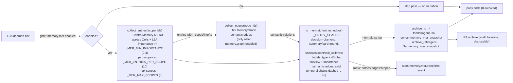
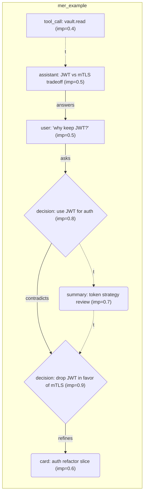

# L3 — Memory System (4 rings + side-channels)

How agents remember: operational rings, lossless archive, and the bypass
side-channels (Mer / R5 / User Profile). 47 files / 11,039 lines.

## Four-ring architecture

```
R1 working   — current task context (agent-local, hot)
R2 short     — session-scale memory (auto-persist, JSONL)
R3 long      — FTS5 searchable knowledge (SQLite)
R4 archive   — lossless, append-only (fonds/series/ref-code), restore baseline
```

| Concern | Module |
|---------|--------|
| Manager + rings | `memory.py`, `memory_ring.py`, `pager_swapper.py` |
| Multi-scope center | `central_memory.py` (register scopes: cells + L3A) |
| Persistence | `persist.py`-style mixins; crash-safety: dirty sets cleared only after write success |
| FTS5 / recall | `context_search.py`, `quality.py` (importance filtering) |
| R4 agent | `r4_agent.py` + `r4_candidate_store.py` (archive, evidence candidates, skill evolution, lean cases) |
| Task-aware injection | `memory_inject.py` (execute→summary / decide→Mer / resume→layered) |
| Init from memories | `memory_init.py` (boot restores agent topology) |

### Persistence concurrency

`PersistableMixin` takes its JSON snapshot while the owning service's state
lock is held, then serializes commits per persistence path. This prevents
torn container iteration and temporary-file collisions when services restart
or tests replace a singleton. Auto-save owns one managed worker per instance:
restarting it signals and waits for the prior worker, and singleton resetters
stop that worker before discarding the service. A delayed pre-reset snapshot
cannot overwrite a later snapshot because per-path commit epochs discard it.

## Side-channels (bypass, all default off)

Independent transformations that never mutate the main flow; on error they
degrade to no-ops (originals intact):

| Channel | Module | What it does | Switch |
|---------|--------|--------------|--------|
| **Mer symbolization** | `memory_mer.py` | Aggregates high-value R1–R3 across scopes → **Mermaid flowchart** (node shapes = entry type: decision=diamond, summary/card=round; labels carry importance; R5 semantic edges solid; within-scope temporal chains dashed `-.->|t|`) → R4 (`agent-l3a/memory_mer_snapshot`) | `memory.mer.enabled` |
| **R5 graph** | `memory_graph.py` | SQLite `memory_edges`; rule + semantic (LLM) edges; diffusion recall; compact/reduce | `memory.graph.enabled` |
| **User profile** | `l3/services/user_profile.py` | Typed per-user model (preference/domain_focus/decision_style/rejection/habit/correction/trait/custom); collectors (APPROVAL_RESPONDED → decision_style, CARD_PENDING → domain_focus) + ingest API; rule refiner; TTL/decay; R4 per user; portable export/import; consumed by L3A (see `l3a-central.md`) | `user_profile.enabled` |

Side-channel lifecycle events are ingested into StatsCenter for
observability: Mer emits `stats.memory.mer.switch/transform/archived`, R5
graph emits `stats.memory.graph.switch/edge_mode/compact/semantic` — both
`_emit_event()` hooks publish to MonitorBus AND StatsCenter (best-effort,
never break the bypass pipeline).

### Mer data flow (bypass pipeline)



Guarantees: bypass semantics (never mutates the main flow), lossless
originals (only a rendered condensation is archived), bounded work
(per-scope caps, max scopes, edge truncation).

### Mer symbolization example

All node shapes and edge styles in one view — diamond (decision), round
(summary/card), rect (user/assistant/tool_call); solid arrows are R5
semantic edges, dashed `-.->|t|` arrows are within-scope chronology:



## System-prompt injection (memory-related)

`prompt.inject.memory` (default true) gates task-aware memory context in
agent prompts; `prompt.inject.skills` gates evolved skills + lean failure
cases. See `cross-cutting.md` for the full injection table.

## Contract surface

- `/api/v2/memory*` (store/recall/stats), `/api/v2/memory/graph*` (R5),
  `/api/v2/memory/mer/*` (Mer), `/api/v2/profile*` (user profile)
- `/api/v2/memory/filter` (M1 domain-filter switches),
  `/api/v2/memory/corpus` (M4 correction-corpus export),
  `/api/v2/memory/digest` (conversation digest cache),
  `/api/v2/memory/tool-result` (tool-result offload cache),
  `/api/v2/memory/sensitive` (sensitive-info bypass detection),
  `/api/v2/memory/compression-guard` (recursion threshold + breaker),
  `/api/v2/memory/compaction` (hybrid extractor mode),
  `/api/v2/memory/premise-guard` (post-compaction anchor audit),
  `/api/v2/memory/inject-dedup` (injection content dedup)
- `/api/v2/skills/candidates*` (R4 evidence candidate list, validation,
  canary publication, activation, retirement, collection policy)
- Ports: none dedicated (memory accessed in-process); profile exposes
  port `"profile"` for cross-service queries
- Tiered-cache consumers: the per-Cell `run_code` program cache
  (`run_code_cache.py`, Code Mode / PTC) stores model-written programs +
  results in the tiered-cache L1 layer with TTL; see
  `docs/architecture/l3-tool-presentation.md`.

## Domain filtering & refinement (M1–M4)

The write path (`memory.py` remember → `memory_ingest`) and every retrieval
path (recall, `search_long_term`, `archive_search`) are gated by the M1
domain filter (`memory_domain_filter.py`):

- **Identity/Cell-domain gating**: entries are visible only to the
  requesting identity/Cell. Both switches are operator-controlled
  (`/api/v2/memory/filter` + L2 `/memory filter`): `enabled` (master,
  default off) and `fine_grained` (identity sub-domains). The Cell-domain
  boundary holds in every mode; fine-grained only adds the identity gate.
- **HTN-C identity-hit semantics**: Cell agents are peer entities — the
  active identity comes from `match_identity` on the driving intent/domain
  (verify→test, implement→build), never a static role; unbound single-Cell
  composites fall back to the full `IDENTITY_DEFAULT_SET`.
- **R4 included**: `archive_search` applies the same gate as R1–R3. R4
  entries carry an explicit `cell:<id>` tag on write (`archive_to_r4`),
  which the search path parses into `cell_id` so the Cell gate matches
  archived Mer baselines the same way as live rings; untagged entries stay
  globally visible (system-level records).

The M2 refinery (`memory_refinery.py`) classifies → dedups → cleans →
scores → extracts → transforms every written entry, with a burn-back
re-refine stage that re-scores clean()-dropped edge entries
(`MEMORY_REFINE_REBURN_*` params). Refined records persist to the L3
archive (`memory:refined_records`) and feed M3 (`memory_supply_chain.py`):
R5 graph edges (`supply_to_r5`, graph-gated), generalized skill evolution
(`supply_to_skills`, switch-gated), and filtered re-injection
(`re_inject_filtered`). M4 (`memory_record_source.py`) registers a
RecordCenter source exporting identity/Cell-feature/log-enriched corpus
for training correction, exposed via `/api/v2/memory/corpus` + L2
`/memory corpus` (`export_corpus`).

### M3 → R5 graph contract

`supply_to_r5` is a non-blocking side-channel. With R5 disabled it returns
zero and leaves refined records untouched. In `hybrid` edge mode it passes
bounded `{id, entry_type, content}` candidates to the graph's injectable
semantic engine; only validated `contradicts`, `depends_on`, or `refines`
relations become edges. Engine failure is caught by the graph state machine,
which moves semantic extraction to `paused`; rule-based edges remain
available in `off`, `rules`, and `paused` modes. LLM-derived topology is
attributable and recoverable without making a memory write depend on the LLM.

**Reference-channel linkage**: every accepted memory write emits a
`memory_refined` event on the reference channel (`get_rc().event`, source
`memory_ingest`) carrying entry id/type/cell/agent/importance/ring — the
causal audit ring correlates memory events with tool and identity context
for M4 corpus analytics. Best-effort, never blocks the write.

### R4 evidence candidates (3.4)

R4 skill evolution is gated by `r4_candidate_store.py`, a persistent JSON
ledger under the Praxis data directory. Refined-memory records and tool
failure traces enter as evidence; they do **not** publish a skill directly.
Candidates group records by source, entry type, tags, and normalized binding:

```
observed -> validated -> canary -> active
                         \-> retired
```

- `validated` requires `R4_CANDIDATE_MIN_EVIDENCE` records and a valid
  posture binding.
- `canary` publication requires an explicit target (Cell, role, Agent, or
  card nature). It calls the boot-managed R4Agent to generate a bound skill,
  never a fresh R4 worker per memory write.
- `active` promotes a canary only through the candidate control surface;
  `retired` removes its skill from injection while retaining audit history.
- Binding fields (`cell_ids`, `roles`, `agent_ids`, `card_natures`,
  `postures`) persist with the skill and are applied before similarity ranking.
  `draft`, `retired`, and `deprecated` skills are never injected.

Candidate collection is independent from LLM distillation cost and is
controlled by `skill.candidate_enabled` (params default → SettingsCenter →
`praxis.yaml` / API / L2). The ledger and reference-channel paths are
observability side channels: a persistence failure never blocks memory writes
or failure-trace capture.

#### Candidate performance and rewrite seam

The candidate ledger is on a memory-refinery write path, so its hot path has
explicit bounds: fingerprint lookup is indexed (not a full-candidate scan),
evidence is capped by the `R4_CANDIDATE_MAX_EVIDENCE` parameter, and the lock
does not cover LLM calls or skill publication. Persistence is a side channel;
an I/O failure degrades the ledger operation without blocking the originating
memory or tool-failure write. Implementations should keep serialized snapshots
and compaction policy behind the store boundary so write latency does not grow
with the lifetime of the archive. The reference implementation appends
mutations to the `R4_CANDIDATE_JOURNAL_SUFFIX` journal, compacts at
`R4_CANDIDATE_JOURNAL_COMPACT_ENTRIES`, and bounds the live set with
`R4_CANDIDATE_MAX_RECORDS`; evicted records go to
`R4_CANDIDATE_ARCHIVE_SUFFIX` for lossless retention.

`CandidateLedgerPort` is the language-neutral adapter seam for listing,
validation, lifecycle transitions, and policy state. Its typed boundary uses
`CandidateSnapshot`, `CandidateStatus`, `CandidateResult`, and `CandidateState`
from `l1.kernel.ports.types`; each value remains serializable to the stable
JSON-shaped schema (`id`, `fingerprint`, `binding`, `evidence`, `validation`,
`state`, and timestamps). Lifecycle state names and limits come from `params/`
and remain the single source of truth. Publication intent and LLM orchestration
stay in L3 above the port. A future Rust ledger can therefore replace indexed
storage and transition checks through the same typed port while the Python L3
orchestration, API, L2 shell, and callers remain unchanged. The Rust adapter
must preserve atomic transition semantics, bounded evidence, and best-effort
persistence behavior.

The live ledger is deliberately bounded by `R4_CANDIDATE_MAX_RECORDS`. An
O(1) fingerprint index groups repeated evidence; when capacity is reached,
only the oldest `observed` or `retired` record may be losslessly archived and
evicted. If every record is lifecycle-protected, a new cluster is reported as
capacity-limited rather than allowing the bound to grow.

Persistence uses a JSON snapshot plus replayable journal batches. The hot
path coalesces at most one pending mutation per candidate into a single
background writer, so ordinary journal and compaction I/O never run while the
candidate-state lock is held. `CandidateStore.flush()`/`close()` provide the
explicit durability barrier for shutdown and tests; normal evidence capture
remains best-effort. `CandidateLedgerPort` carries typed primitive-only
evidence, snapshot, status, and lifecycle values so its Python adapter can be
replaced by a Rust implementation without changing memory, API, or shell
callers.

## Conversation-side compression (two-layer pipeline)

Compression is split into **two physically isolated pipelines** — one for
the execution layer (Peer Agents) and one for the decision layer (L3A
central). The layers never share a session context: an execution-layer
agent's conversation never touches another agent's, and neither crosses
into the decision layer except through the sanctioned injection channels
(R4 skills, shared skill zones, R5 generalized skills). Consequently L3A
does not carry execution-context pressure while keeping precise control
over each agent's context.

**Execution layer (Peer Agents, `agent/` + `agent_loop.py`)** — folded
inside the AgentLoop run path, keyed by card index:

- **Per-entity context management**: each AgentLoop self-registers in an
  instance register (`register_loop`); `context_snapshot()` returns one
  entity's precise view (trail size, token estimate, card tags/nature,
  digest reference) and `audit_cell_context(cell_id)` aggregates every
  registered loop of a Cell — the management surface for the execution
  layer's context isolation (each snapshot holds only its own entity's
  data). Exposed via `GET /api/v2/memory/context-audit` + L2
  `/memory context-audit [cell_id]`.
- **Digest cache** (`agent/digest_cache.py`): when the master switch is on
  (default on), a folded conversation span (`_truncate_trail`) is
  condensed into a character-capped digest and stored in the tiered-cache
  L2 shared-summary layer, keyed by card index
  (`{cell_id}::{card_id}::digest`); the trail keeps the digest line and
  `get_digest` recovers it. Switches: `/api/v2/memory/digest` + L2
  `/memory digest [on|off] [max_chars=N]` (`DIGEST_ENABLED_DEFAULT` on,
  `DIGEST_MAX_CHARS_DEFAULT` 400).
- **Tool-result offload** (`agent/tool_result_cache.py`): when enabled
  (default on), an oversized structured tool result is offloaded to an
  in-memory register (O(1) fast path) mirroring the per-Cell tiered-cache
  L1 buffer (key `cell:{cell_id}::tool:{call_id}`) via
  `_fold_result`/`maybe_offload`; the trail keeps a reference line with
  digest and `fetch_result` recovers the full payload (register first,
  buffer fallback). The model recovers offloaded payloads on demand with
  the `tool_result_read` dynamic tool (Ring 1, call_id argument, read-back
  bounded by `TOOL_RESULT_READBACK_MAX_CHARS`); offloaded reference lines
  carry a `_readback_note` hint. Switches: `/api/v2/memory/tool-result` +
  L2 `/memory tool-result [on|off] [max_chars=N]`
  (`TOOL_RESULT_OFFLOAD_ENABLED_DEFAULT` on, `MAX_CHARS` 4000).
- **Reclaim (lifecycle)**: expired entries are dropped lazily by the
  tiered-cache `get` path (physical delete, L1 60s / L2 300s TTL) and by
  capacity eviction; additionally, `reclaim(cell_id)` performs an explicit
  per-Cell sweep, hooked into Cell teardown (`cell_lifecycle`) alongside
  the `run_code_cache` reclaim — the conversation-side caches live and die
  with the Cell lifecycle.

**Decision layer (L3A central, `cell/peers/l3a/session_compress.py`)** —
the progressive five-level pipeline (`compress()`: raw / summarized /
retained / skeleton / headline), lossless R4 snapshot, compression-ratio
baseline, content-fingerprint dedup, and the recursion guard + circuit
breaker; see `docs/architecture/l3a-central.md` (History compression).

**Shared guardrails** (both layers, operator-switchable):

- **Sensitive-info bypass detection** (`agent/sensitive_detect.py`,
  default ON): scans folded summaries for API keys / bearer tokens /
  private keys / IP literals; hits are reported on the compression result,
  never blocking the fold. Switches: `/api/v2/memory/sensitive` + L2
  `/memory sensitive [on|off]`.
- **Recursion guard + circuit breaker** (`agent/compression_guard.py`):
  recursive-compression threshold (default off, 0) bounds consecutive
  passes per session; the circuit breaker (default on) trips on the
  threshold, pauses compression, and records evidence.

## Hybrid compaction extractor (compaction)

`memory_extract.py` — the compaction front end for both layers. Instead of
plain concatenation, a deterministic heuristic extractor keeps high-signal
lines (paths, commands, error codes, version pins, decision anchors) and
drops conversational filler, raising the compression ratio while preserving
the facts the agent acts on. Three operator modes:

| Mode | Behavior |
|------|----------|
| `deterministic` (default) | heuristic line classifier only — no LLM, never raises |
| `llm-assisted` | optional LLM-structured extraction (bypass); degrades to deterministic on failure/expiry, never blocks the main flow |
| `off` | legacy concatenation/truncation unchanged |

Wired into `memory_compact.py::compact()` (execution layer) and
`session_compress.py::_build_summary` (L3A decision layer — folded context
stays fact-dense). Params `MEMORY_COMPACTION_*`; switches:
`/api/v2/memory/compaction` (GET mode / PUT
`{mode: deterministic|llm-assisted|off}`) + L2 `/memory compaction
[deterministic|llm-assisted|off]`; settings `memory.compaction_mode`.

## Premise guard (premise-guard)

`premise_guard.py` — post-compaction anchor audit for the decision layer.
Before a fold, high-value anchors (user intents, constraints, convention
references — `_ANCHOR_RE` signals) are collected and fingerprinted; after
folding, anchors missing from the summary produce a one-shot reminder
appended to the folded context, so a lost premise is surfaced instead of
silently dropped. Deterministic, side-channel safe, never raises. Wired
into both compression paths. Params `PREMISE_GUARD_*`; switches:
`/api/v2/memory/premise-guard` + L2 `/memory premise-guard [on|off]`;
settings `memory.premise_guard` (default on).

## Memory-injection dedup (inject-dedup)

`memory_context.py` — content-fingerprint dedup on the injection path:
repeated lines inside the assembled context blocks (Working Memory /
Recent History / Knowledge) are injected once per prompt, so the agent
never pays tokens twice for the same content. Watermark lines are never
treated as duplicates. The L3A decision layer inherits the dedup through
`memory_inject.build_context`. Params `MEMORY_INJECT_DEDUP_*`; switches:
`/api/v2/memory/inject-dedup` + L2 `/memory inject-dedup [on|off]`;
settings `memory.inject_dedup` (default on).

## Per-Cell Agents handbook (Cell-{n}-Agents.md)

Per-Cell department briefs activate at 2+ Cells (`register_cell` →
`agent_md_active`): `agents_md.py` assembles `Cell-{cell_id}-Agents.md`
with the Cell's declared department (config-driven) + a constitution
digest, writes it via the sandbox, and mirrors it into the L3 tiered cache
so `agent_loop_context` can inject it into the peer agents' system prompt
(gated by `prompt.inject.skills`). Single Cell → no handbook.
