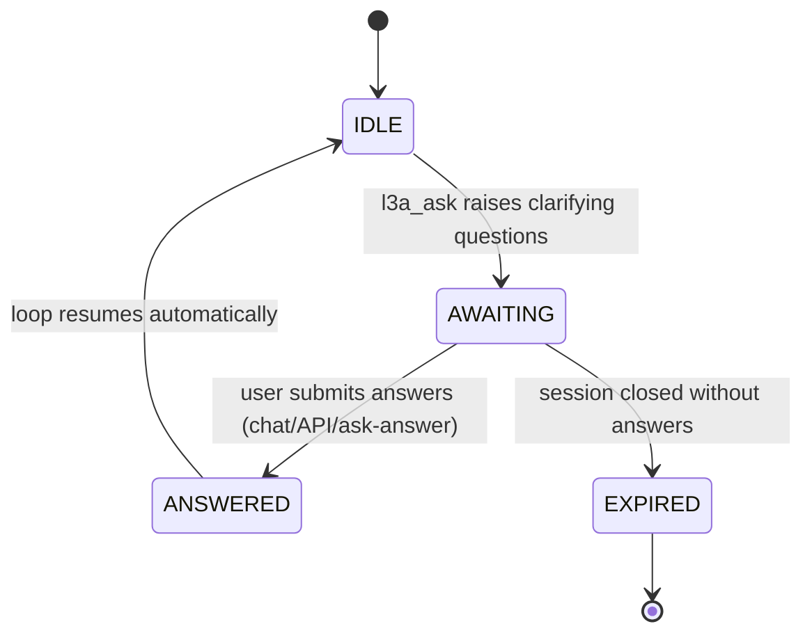
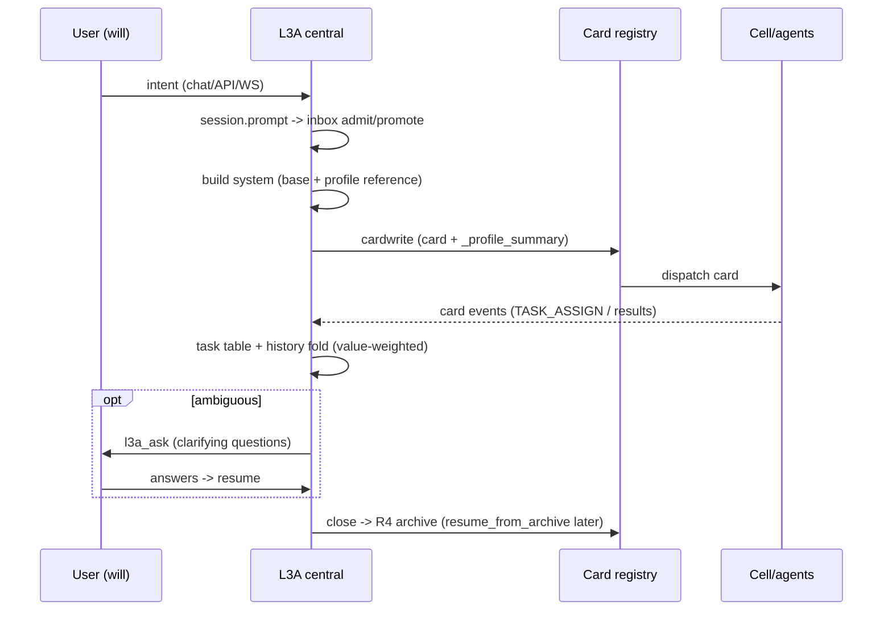

# L3A — The Central Decision Layer

L3A is not another agent loop — it is the **central office** between the
will (user) and the departments (cells/agents). 24 files / 6,134 lines in
`src/l3/cell/peers/l3a/`.

```
User (will) ──intent──> L3A central ──card──> Cell/agents (execution)
                          │  ▲
                          │  └─ results, asks, events
                          └─── archive → R4 / profile → Mer/R5
```

## State metaphor (why it is a layer, not a loop)

| L3A module | Office analogue | Behavior |
|------------|-----------------|----------|
| `session.py` | case files | Session/SessionHistory/SessionManager; cursor-paged `messages(cursor, limit)`; value-weighted compression; `resume_from_archive` |
| `ask.py` | secretary querying the will | l3a_ask clarification state machine (awaiting → answers → resume) |
| `helpers.py` cardwrite | policy issuance | intent → structured card; attaches user profile `_profile_summary` |
| `helpers.py` cardwrite (offensive) | action warrant | `nature="offensive"` cards are action warrants — issued ONLY when the system posture is full-power attack (`security.mode=security-test` + detection-bypass confirmed); otherwise rejected with `OFFENSIVE_WARRANT_DENIED`. Issued/denied counters land in StatsCenter (`security.warrant.issued/denied`). |
| `helpers.py` convergence | cabinet consultation | multi-agent result convergence |
| `subagent.py` | staff pool | L3ASubAgentPool: spawn/collect/peek |
| `task_table.py` | docket | per-session card task monitor |
| `inbox.py` | intake registry | durable prompt admission/promotion |
| `context.py` | policy epoch | ContextEpoch / ContextRegistry |
| `archive.py` | national archive | R4 store/restore glue |
| `pipeline.py` | document control | ManagedToolOutput (oversized result spill) |
| `model.py` | budget rules | L3AModelConfig inheritance chain |

## Decision-layer compression fidelity (compaction + premise guard)

The L3A session fold (`session_compress.py::compress`, five-level
rate-distortion pipeline) is the decision layer's memory of the will — a
lost premise there is a lost intent. Two mechanisms protect it:

- **Hybrid compaction extractor** (`l3.memory.memory_extract`): the
  assembled summary passes through the deterministic extractor (keeps
  paths/commands/error codes/decision anchors, drops filler) unless the
  operator mode is `off`; `llm-assisted` upgrades it with an LLM bypass
  that degrades to deterministic on failure. Switch: `/api/v2/memory/
  compaction` + L2 `/memory compaction` (see `l3-memory.md`).
- **Premise guard** (`l3.memory.premise_guard`): before the fold, anchors
  (intents/constraints/convention refs) are fingerprinted; after folding,
  anchors missing from the summary append a one-shot reminder so a lost
  premise is surfaced, never silently dropped. Switch: `/api/v2/memory/
  premise-guard` + L2 `/memory premise-guard`.

## Session contract (language-agnostic)

Exposed over `/api/v2/l3a/*` so any frontend (TUI/desktop/TS) drives the
central layer purely over HTTP:

| Endpoint | Purpose |
|----------|---------|
| `POST /api/v2/l3a/sessions` | create session |
| `GET  /api/v2/l3a/sessions` | list active sessions |
| `GET  /api/v2/l3a/sessions/{id}` | detail (info + todos) |
| `GET  /api/v2/l3a/sessions/{id}/messages?cursor=` | **cursor-paged history** (anti-blowup) |
| `POST /api/v2/l3a/sessions/{id}/send` | send intent / continue |
| `POST /api/v2/l3a/sessions/{id}/close` | close + R4 archive |
| `POST /api/v2/l3a/sessions/{id}/compress` | manual history compression |
| `POST /api/v2/l3a/ask/status` / `ask/answer` | clarification flow |

## Ask flow (secretary requests the will's decision)



`ask_status()` / `submit_answers()` / `resume_after_ask()` expose the
state machine; `POST /api/v2/l3a/ask/status|answer` expose it over HTTP.

## Session lifecycle (one will-decision cycle)



## System prompt (what the central layer knows)

`build_l3a_prompt(user_id)` assembles: role + card types + cardwrite steps
+ ask guidance + **`[User Profile Reference]`** (preferences/traits — gated
by `prompt.inject.profile`, injected only when the session carries a
`user_id`). `l3a.parse_system` template is a fallback (AgentLoop uses the
injected `system` argument first).

## Profile consumption

- **Prompt injection**: session base system carries the user model.
- **Card columns**: session cardwrite forwards `user_id` → `_profile_summary`.
- **Collectors**: approval decisions and pending cards feed the profile
  (decision_style / domain_focus) — the central layer's knowledge of the
  will grows with every decision.

## Ticks & lifecycle

- L3A daemon tick drives Mer symbolization (when enabled) and session
  upkeep; conftest resets via `reset_daemon()`.

## History compression (progressive five-level pipeline)

`SessionCompressMixin.compress` folds an older message span into a summary
while keeping the most recent `keep_last` messages raw. The fold is
rate-distortion aware and progressive:

| Level | Policy |
|-------|--------|
| raw | high-value messages (user intents, card results, convention refs) preserved verbatim |
| summarized | medium-value messages condensed to preview lines |
| retained | the most recent `keep_last` messages stay raw |
| skeleton | low-value messages reduced to a count line |
| headline | the earliest user intent becomes one `HEADLINE:` line |

Every fold is **lossless by deferred access**: the full span is snapshotted
to the R4 archive (fonds `AGENT:l3a`, series `session_compression_snapshot`)
before folding, and the result carries a `snapshot_ref`. Reports include
the **compression-ratio baseline** (`compression_ratio` = before/after
token counts; `0.0` when nothing folded), the stale-duplicate count
(`deduplicated` — identical user messages collapse to one by content
fingerprint), the five-level stats (`levels`), and any sensitive-info hits
(`sensitive_hits`, see below).

**Recursion guard**: an operator-gated threshold (`/api/v2/memory/
compression-guard`, L2 `/memory compression-guard threshold=N`) bounds
consecutive compression passes per session (default `0` = recursive
compression off). When reached, compression stops and prompts for manual
intervention. A circuit breaker (default ON) trips on the threshold hit,
pauses compression, and records evidence for later analysis; setting a new
threshold resets a tripped breaker.

**Sensitive-info bypass detection**: `agent/sensitive_detect.py` (default
ON, switchable via `/api/v2/memory/sensitive` + L2 `/memory sensitive`)
scans each folded summary for API keys / bearer tokens / private keys / IP
literals; hits are reported, never blocking the fold.

## Session management (3.3)

The decision layer runs ONE session entity (the secretary expands
dynamically); the execution layer runs 3 Peer Agent sessions (equal
rights). The management system covers:

| Feature | Surface |
|---------|---------|
| Dual identity (session_id ↔ process_id ↔ terminal) | `agent_terminal` session registry, bound at `Session` construction |
| Session monitor (default ON) | `session_monitor()` + `GET/PUT /api/v2/session-monitor` + L2 `/session monitor` |
| Auto-reload on anomaly (default ON) | `auto_reload_session` / `on_stagnation` + `POST /api/v2/session-reload` + L2 `/session reload` |
| Decision-layer JSON trio | conversation (`*_conversation.json`, tagged user/answer layers + input seq), thought chain (`*_thoughts.json`, R5 feed), tool failures (`*_tools.json`, successes dropped) — `session_json.py` |
| Session history (default ON) | `record_session_open/close` (start/end/duration) + `GET/PUT /api/v2/session-history` + L2 `/session history` |
| Dynamic loader + TUI resume | `session_loader.py` (pagination + label alternation + cache hits) + L2 `/session resume` |

The decision-layer JSON files are compact and referenced by tags (session
id + input-sequence id); successful tool calls are dropped, failed ones
kept for R5 analysis and skill formation.

## Decision-center semantics (3.4)

`L3ADaemon.decide()` is the decision surface that turns L3A from a session
bookkeeper into an **intent-interpreting entity** — it interprets a user
intent via the generic three-identity matcher (`match_identity`), suggests
the owning department (`suggest_department`), reports whether department
division is active (`division_active`, switch AND `CELL_DEPARTMENT_MIN`
threshold), and resolves the model executor for the suggested department
(`model_role_for`). The final department choice stays config-driven and
user-settable; `decide()` only advises.

The **L3A-C secretary** (`secretary.py`) is the analysis/reporting
assistant of the decision center: it records contributions (analysis /
report / card production) with a capability score, and crossing
`L3AC_CAPABILITY_THRESHOLD` upgrades it from **assist** (non-egalitarian)
to **peer** (a real egalitarian entity) by spawning its own background
session bound to an isolated `l3a-c-<n>` memory scope + identity fragment.
The upgrade is operator-controllable (`set_enabled` / `set_threshold` /
`set_mode` — never code-embedded).

The **test-matrix prebuild** (`test_matrix_prebuild.py`, Phase 3.1) is the
testing department's async precompute: when division is active and the
`departments.test_matrix_prebuild` switch is on, matrices are built in a
bounded background pool and cached in the tiered-cache L2 layer; the
tester-role AgentLoop injects the prebuilt matrix into its system prompt
(budget-capped), falling back to a synchronous build on cache miss.

